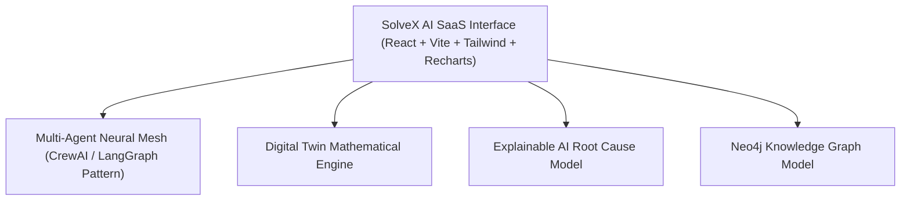

# SolveX AI - Enterprise Intelligence Operating System

> **"One Brain. Every Department. Smarter Decisions."**

SolveX AI is an **Enterprise Intelligence Operating System** powered by a Multi-Agent Neural Mesh, Enterprise Knowledge Graph, and Digital Twin Decision Simulator. It sits above existing enterprise software (ERP, CRM, SCM, HRMS) to continuously collect cross-departmental telemetry, predict operational risks, simulate strategic decisions, explain root causes, and orchestrate autonomous workflows.

---

## 🚀 Key Features & Core Differentiators

* **Multi-Agent Collaboration Engine**: 10 specialized AI Agents (Inventory, Sales, Finance, HR, Production, Supplier, Customer Intelligence, Logistics, Compliance, Risk Management) that debate enterprise crises and formulate unified consensus decisions.
* **Enterprise Knowledge Graph**: Interactive 50+ node ontology mapping relationships across departments, suppliers, facilities, machines, workforce, and active client orders.
* **Digital Twin & Decision Simulator**: Virtual enterprise model allowing executives to simulate "What happens if production increases by 30%?" with real-time math-backed projections for revenue, profit margin, employee stress, machine OEE, delivery delay, carbon footprint, and ROI.
* **Predictions & Root Cause Engine**: Explainable AI causality breakdown tracing every anomaly to its underlying systemic origin ("What happened", "Why", "Who caused it", "Financial Impact", "Mitigation").
* **AI Business Copilot**: Natural language executive chat assistant providing inline charts, data tables, node highlights, and 1-click execution triggers.
* **Command Center Dashboard**: Executive cockpit with global Enterprise Health Score (88/100), live department health cards, real-time risk alert ticker, and decision audit logs.
* **Autonomous Workflow & Approval Queue**: Routine actions run automatically; high-value critical operations prompt 1-click manager authorization.

---

## 🏗️ Architecture & Technology Stack



* **Frontend**: React 19, Vite, Tailwind CSS v4, Framer Motion, Recharts, Lucide Icons, Canvas Confetti.
* **Agent Engine**: Multi-Agent inter-process communication simulator with confidence scoring & consensus algorithms.
* **Simulation Physics Engine**: Dynamic mathematical stress calculator for multi-variable scenario modeling.
* **Design System**: Obsidian glassmorphism theme inspired by Linear, Copilot, Vercel, and Apple.

---

## 💻 Local Setup & Execution Guide

### Prerequisites
* **Node.js**: v18.0.0 or higher
* **npm**: v9.0.0 or higher

### Step 1: Clone & Install Dependencies
```bash
cd SOLVE_X
npm install
```

### Step 2: Launch Development Server
```bash
npm run dev
```

### Step 3: Production Build & Validation
```bash
npm run build
npm run preview
```

---

## 🏆 Smart India Hackathon (SIH) & Startup Pitch Summary

Traditional ERPs store historical data but cannot predict or reason across department silos. **SolveX AI** transforms passive enterprise reporting into proactive autonomous intelligence, enabling managers to save millions in breakdown losses, avoid stockouts, and execute decisions with 94%+ AI confidence.
