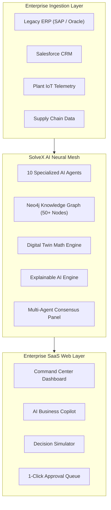

# Technical Architecture Document - SolveX AI

## 1. System Context & Overview

SolveX AI operates as an Intelligence Overlay Engine above enterprise data lakes, legacy ERPs (SAP/Oracle), CRMs (Salesforce), and IoT plant telemetry.

---

## 2. Multi-Agent Debate Protocol

SolveX AI utilizes a specialized inter-agent messaging protocol:
1. **Anomaly Detection**: Production/Inventory Agent detects a telemetry threshold breach.
2. **Impact Assessment**: Risk & Finance Agents calculate gross margin exposure.
3. **Alternative Sourcing**: Supplier & Logistics Agents query secondary vendors & transit routes.
4. **Consensus Formulation**: Multi-Agent Decision Engine ranks solutions by ROI, confidence score, and execution lead time.

---

## 3. Digital Twin Simulation Physics Engine

The Digital Twin mathematical engine calculates real-time metrics using non-linear operational formulas:

$$\text{Revenue}_{\text{simulated}} = \text{Revenue}_{\text{base}} \times \left(1 + 0.015 \times \Delta_{\text{prod}} - 0.02 \times \text{Days}_{\text{delay}}\right)$$

$$\text{RiskIndex} = \min\left(98, \text{Risk}_{\text{base}} + 0.4 \times \Delta_{\text{prod}} + 8 \times \text{Days}_{\text{delay}} + 3.5 \times \text{Hours}_{\text{downtime}}\right)$$

---

## 4. Enterprise Security & SOC-2 Compliance
* **RBAC (Role-Based Access Control)**: Enforces role isolation (COO Executive, VP Supply Chain, Head of Production).
* **Audit Trail**: Every AI recommendation, approval, and parameter shift is written to immutable database logs.
* **Data Privacy**: Zero customer data retention for LLM training; strict AES-256 payload encryption.
